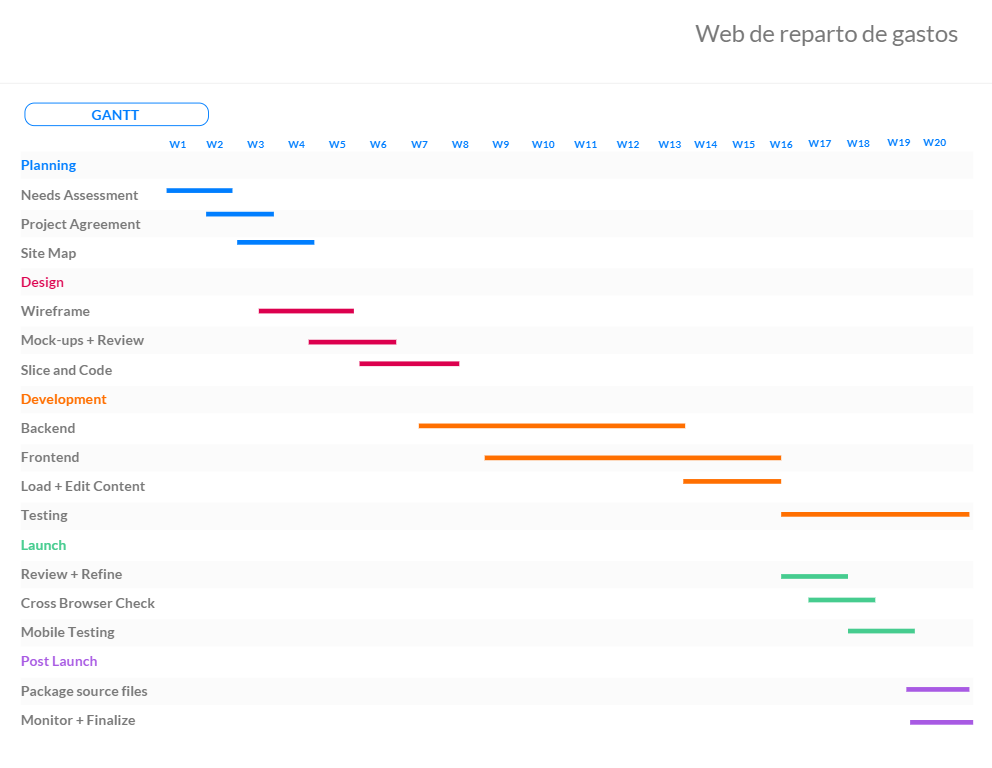
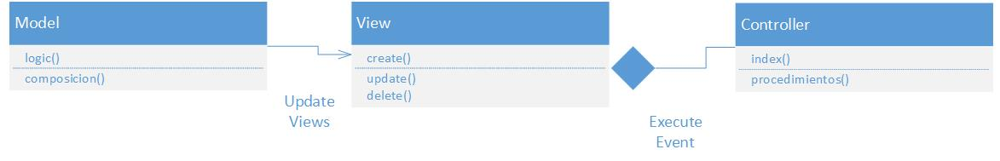
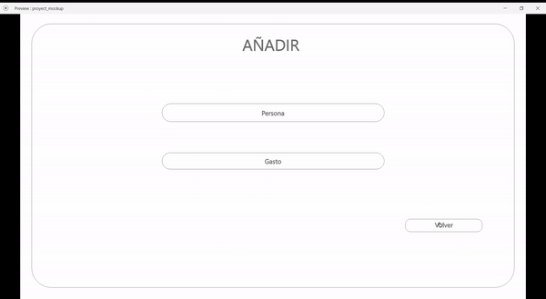
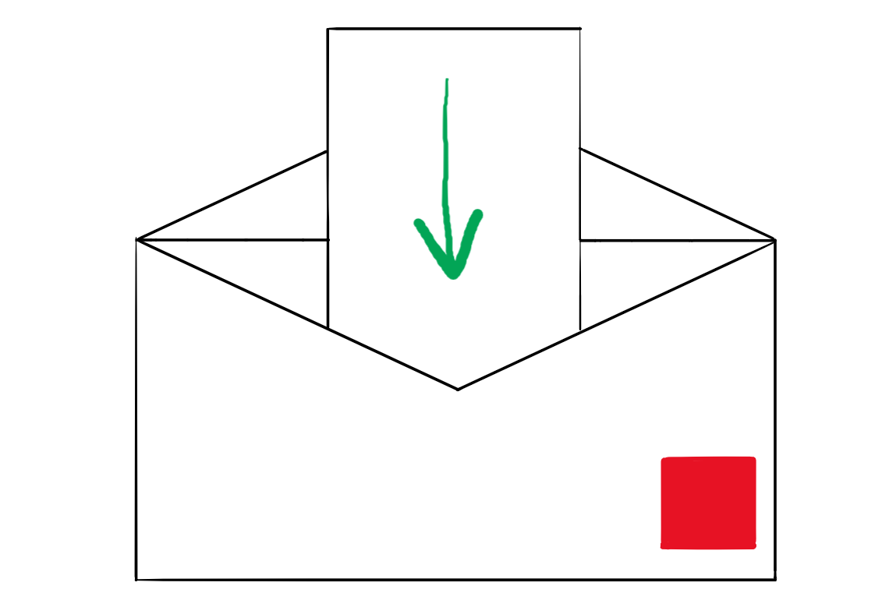
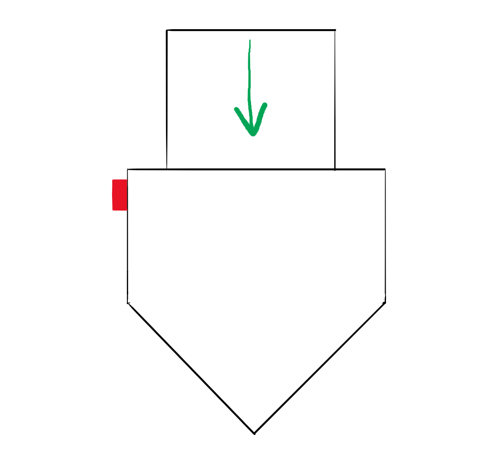
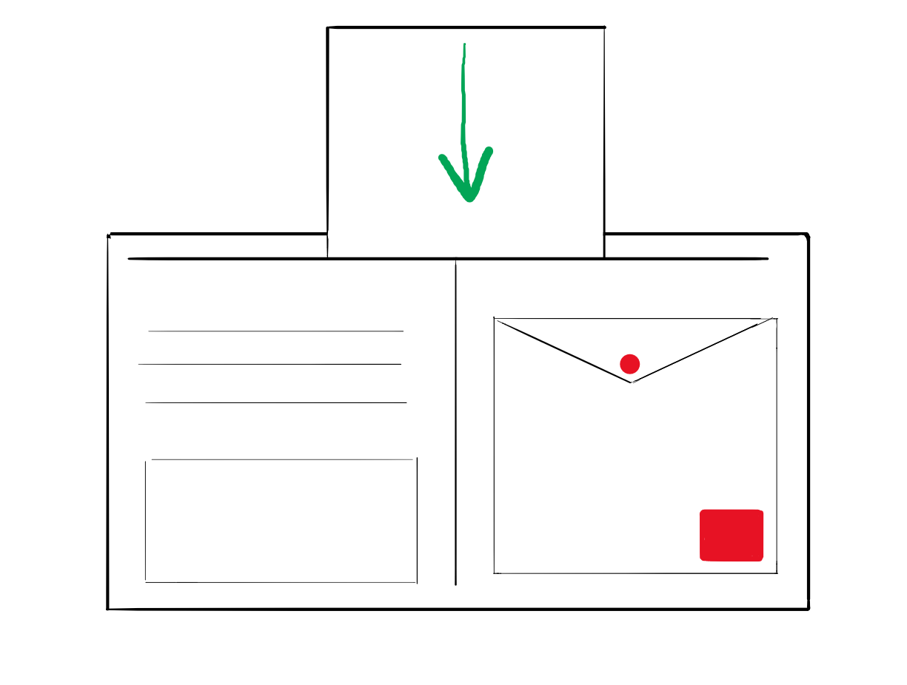
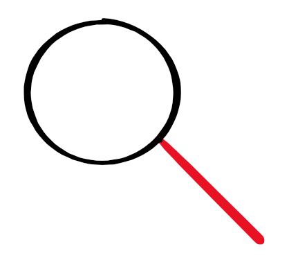
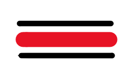
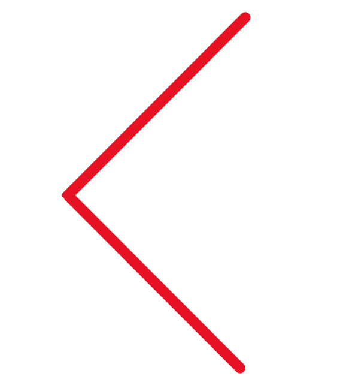
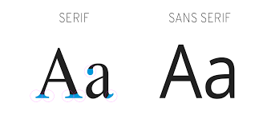

# ANÁLISIS PREVIO

### Descripción del proyecto realizado

El proyecto elegido es el de una aplicación web cuya finalidad es la de organizar el reparto de gastos entre diferentes usuarios dentro de "listas de gastos".

La aplicación web tendrá una página principal explicando el funcionamiento de la misma, además en dicha página encontraremos los links de sign up y el link de log in, para registrarse o hacer login respectivamente.

Al hacer click sobre el botón sign up podrás registrarte mediante un correo electrónico y una contraseña, y en el login podrás entrar con tus credenciales con los cuales te has registrado. Además, puedes hacer log in con google, github, facebook.

Una vez dentro de la aplicación, nos dirigirá hacia el home, esta página servirá de inicio cuando se entre en una cuenta. En ella nos encontraremos un menu superior con los diferentes apartados que comentamos a continuación: 
- INICIO: que contendrá una apartado denominado "Listas de gastos", en la cual aparecerá el nombre de la lista y el saldo total del usuario.
- ÁREA PERSONAL: en el cual se hace un reporte total de los gastos, deudas y deudores que tiene el usuario con el cual se ha hecho login. En este, se representarán los datos mediante graficos, tablas, y colores para distinguir perfectamente el origen de cada dato. La finalidad de este apartado es el de contener en un mismo espacio la totalidad de las transacciones y a la vez que la clasificación de los gastos que se han realizado distiguiendolos en distintas categorias.
- ÁREA DE CONTACTO: este apartado contendrá un formulario de contacto  mediante el cuál a traves de introducir un correo y un asunto, puede un usuario comunicarse con los administradores para realizar cualquier consulta.
- CONFIGURACIÓN: este apartado servirá para poder cambiar la contraseña del usuario, correo así como eliminar la cuenta si el usuario desease.
En relación a las listas de gastos, cada una de ellas puede contener de dos a un máximo de diez usuarios, cada usuario puede agregar nuevos gastos, cada gasto tendrá al menos un origen y un importe siendo este último positivo y superior a cero.

El gasto, una vez introducido en la lista se dividirá entre el total de participantes.
```
Posible logaritmo para el reparto eficiente de los gastos:
A------------B--------------------C
A--------------------------------C
```
Un usuario a su vez tiene la posibilidad de hacer un pago de una deuda a su acreedor, con el fín de satisfacer la deuda total que tiene con este o aminorarla.

### Descripcion de requisitos a cumplir por la aplicación

En este apartado definiremos los requisitos los cuales se deben cumplir por la aplicación:
- Una página principal que explique el funcionamiento de la aplicacion web, en el cual se incluyan los botones de sign up y de login.
- Un sign up donde registrarse con un correo y una contraseña.
- Un login donde entrar en tu cuenta de usuario, más la posibilidad de hacer login con cuentas de terceros como google, github y facebook.
- Una cuenta home de cada usuario, donde aparecen las listas de gasto en las que el usuario está agregado.
- Un apartado de área personal donde se resumen la totalidad de las actividades, gastos y deudores que tiene un usuario en el sumatorio de listas de gastos.
- Un área de contacto, donde poder contactar con el desarrollador por posibles problemas e intereses.
- Un area de configuración donde el usuario podrá cambiar contraseña correo o eliminar su cuenta.
- Una vista de lista de usuario en la cual agregar gastos en relación a origen y cantidad, agregar usuarios a la lista, borrar usuarios de la lista, pagar cantidades.
- Un botón de log out donde cerrar sesión.
- La aplicación web debe ser responsive para facilitar su uso tanto en tabletas como en teléfonos móviles.

### Estudio de mercado

Ante esta propuesta de aplicación web, nos encontramos de cara con la incertidumbre que todo tipo de proyecto conlleva. Para esclarecer el marco actual y futuro en el que nos encontramos y la aplicación web se encotrará, vamos a realizar un estudio de mercado enfocado en aquellas aplicaciones tanto de móvil como aplicaciones web las cuales tiene un mercado similar o comparten mercado con nuestra aplicación.

En relación a las aplicaciones móviles tenemos las siguientes apps compitiendo en el mercado de reparto de gastos: 
1. Splitwise
2. Billr
3. Divvy
4. SpotMe
5. SettleUp

Todas estas apps son aplicaciones muy reconocidas en el ámbito de reparto de gastos, son aplicaciones modernas en las cuales se valora la facilidad al usarse, el diseño de la interfaz.

Éstas conclusiones anteriormente señaladas van a ser el objetivo primordial a la hora de planificar y desarollar nuestra aplicación debido a que éstas están extraidas directamente sobre la media de los comentarios que usuarios de ambas aplicaciones y tanto en Android con en iOS han querido compartir en los comantarios de los app stores de cada sistema operativo.

Una de las decisiones fundamentales por las que hemos tomado la decisión de que nuestra aplicación sea una aplicación web y no una aplicación móvil es la falta de cubrir ese campo dentro de ese mercado, ya que uno de los problemas a los que se enfrentan los usuarios de las aplicaciones móviles es que a la hora de dejar el móvil e irse al ordenador con el fin de hacerse una idea más amplia y general se encuentran con que dichas aplicaciones no tienen desarrollada una aplicación web que complemente la app de móvil.

En cuanto a las aplicaciones móviles que también tienes una posibilidad de consulta en la web, solamente encontramos a Tricount cuya aplicación es de móvil acompañada con una pequeña simulación web de tus datos.

Tras los resultados obtenidos de esta investigación de mercados hemos determinado que el proyecto parece viable y se distingue de la competencia otorgandole un aspecto más profesional (al poder se utilizado con pantallas más grandes de ordenadores y teclado y ratón), y además por la posibilidad de, sin desarrollar una aplicación de móvil que supondría el pedir los permisos y entrar en las app stores, utilizarla como aplicacion móvil al hacer la página responsive, adaptable a todo tipo de pantallas. Además en la página de home de la misma se incluirá un tutorial como, mediante un móvil  y con el navegador chome, se puede convertir en aplicación de movil disponible en la pantalla de inicio de tu dispositivo.

___
A continuación tras este estudio de mercado hemos realizado un DAFO con el fin de situarnos tanto en el aspecto del análisis interno, así como en el análisis externo.
En la primera columna de la tabla encontraremos el análisis interno y en la segunda el externo.

**DAFO**

| Debilidades | Amenazas |
| ---------- | ---------- |
| - Publicidad, la dificultad de darte a conocer a diferencia de la competencia| - Posible ataque de la competencia    |
|- Aplicaciones muy similares con mucha más experiencia y clientes |- Posibilidad de que la competencia nos copie la idea y se lleve a nuestros potenciales clientes|

| Fortalezas  | Oportunidades |
| ---------- | ---------- |
| -Idea ya desarrollada, pero con otro enfoque lo que nos convierte en únicos en el mercado, podemos diferenciarnos de nuestra competencia con facilidad debido a que ofrecemos un servicio parecido pero diferente.  | - Posibilidad de mejorar nuestra posicicón en internet mediante los métodos de SEM (de pago) y SEO (gratuito). El SEM nos permite pagar para que nuestra web aparezca la primera publicitada y SEO para posicionar la página mediante unas palabras claves de búsqueda   |
|- Posibilidad de ver los errores de la competencia y potenciar esos puntos para diferenciarnos|- Oportunidad de financiarnos mediante los anuncios de Google AdSense|
------------


### Planificación del proyecto



# ANÁLISIS Y DISEÑO

### Casos de uso


### Diagrama de clases 


La realización del diagrama de clases actual solamente supone un boceto de como funcionara el mvc del proyecto, ampliandolo y completandolo conforme el proyecto se va desarrollando completamente, mostrando, finalmente su diagrama de clases completo.
En este primer boceto sólamente decimos que la vista llamará y afectará al controlador para que este haga los "procedimientos" tanto de crear, actualizar, borrar, ver y en el modelo se encontrará la lógica del objeto los valores que tiene, etc.

### Mapa navegación aplicación


### Diseño de interfaces

En cuánto al diseño de las interfaces de usuario, hemos creado una lista de las páginas que la aplicación va a nacesitar. Tras desarrollar plenamente la idea del proyecto, se han listado el número de ventanas que formarán parte del flujo que tendrá la aplicación.

El listado de ventanas que formarán parte del flujo de la aplicación son las siguientes:


Una vez tenemos la lista de la ventanas que serán necesarias para la aplicación, creamos el mockUp con las vistas totales que tendrá la aplicación.


Esta imagen anterior es la vista general  de cada una de las vistas que tendrá la aplicación.

Una vez tenemos las vistas definidas, crearemos los flujos que tendrá la aplicación y las relaciones entre cada una de las ventanas.


A continuación adjunto el video con los flujos totales y cual será el flujo total de la aplicación, haciendo que los mockups se conviertan interactivamente en una aplicacion básica virtual.




[Debido a que esto se exporta en pdf no serán visibles los gif sobre las interfaces, así que os adjunto un video para que veais su funcionamiento. La documentación del proyecto se está realizando en markdown]

### Guía de estilos

Tras la realización de los mock ups, y sabiendo ya cuales van a ser las vistas y el contenido de las mismas, ya tenemos los pilares necesarios mediantes los cuales llevar a cabo el diseño del estilo de la aplicación web.

Para realizar esta guía de estilo hay que tener en cuenta primero el público objetivo de nuestra aplicación, que como se ha definido anteriormente, son desde adolescentes hasta personas de alrededor de los cuarenta años. Este amplio publico objetivo hace que tengamos que mostrar una imagen atrevida pero al mismo tiempo sobria, otorgandole la seriedad que puede atraer a gente adulta y logos interactivos y atractivos que pueden ser valorados por el público más joven.
Debido a esta decisión, mantendremos colores muy neutros para los mayores espacion impidiendo así llenar de colores espacios importantes y que puedan resultar incomodos y alejen la experiencia de uso de lo que deseamos. Los colores atrevidos los usaremos para dividir espacios, para logotipos para botones y elementos de la aplicación. Además el uso del color, se reservará para los graficos.

Los colores de nuestra aplicación serán los siguientes:


La elección de los colores tiene que ver con los iconos separadores y botones que tendrá dicha aplicación. A continuación adjunto los diseños iniciales de los **iconos**:










En relación a la **tipografía** elegida para la aplicación web, hemos elegido la tipógrafia SERIF para aquellos texto que sean títulos de secciones o subtitulos necesarios dentro de cada una de las secciones, mientras que la tipografía del contenido de las mismas será mediante la tipografía SANS SERIF.



La eleccion de las mismas es debido a que éstas son perfectamente reconocibles, fáciles de leer y elegantes, La eleccion de SERIF para títulos es debido a que es una tipografía más sobria y elegante, mientras que la eleccion de SANS SERIF como tipografía principal del contenido es debido a la facilidad de lectura que esta conlleva.

### Modelo de datos
**Diagrama E-R** 


**Modelo Relacional**


**Script creación**

La creacion de la BBDD se ha realizado mediante Phpmyadmin y la creacion de las tablas mediante las migraciones correspondientes mediante Laravel 
